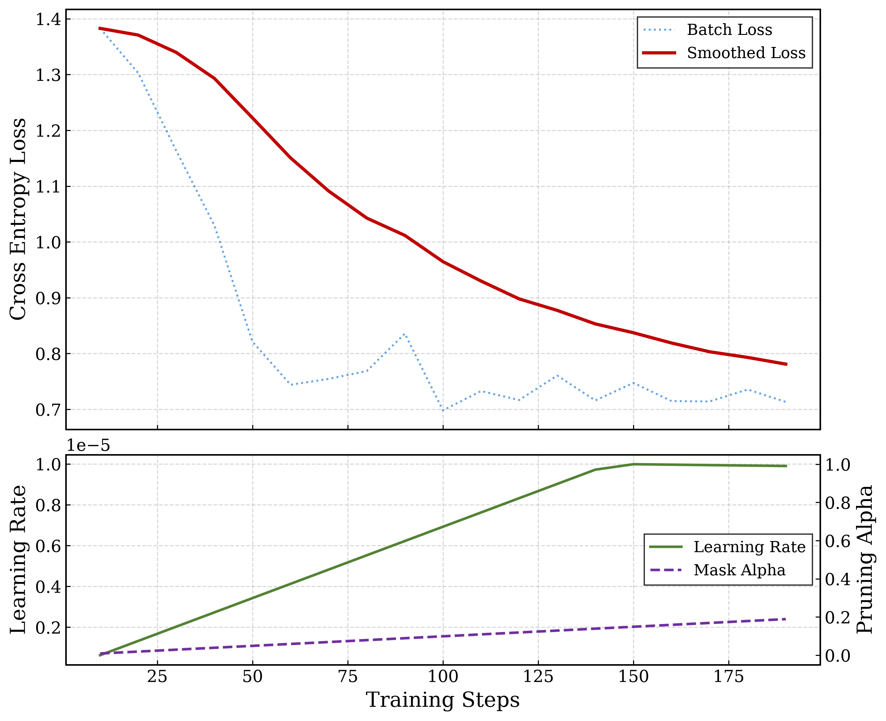

# IFPruning-SFT: Unofficial Reproduction of AFM-3 Instruction-Following Pruning

## 1. Overview

This repository implements the Supervised Fine-Tuning (SFT) phase of the [Instruction-Following Pruning architecture (AFM-3)](https://arxiv.org/abs/2501.02086). IFPruning introduces input-aware activation sparsity into Large Language Models (LLMs) during the alignment phase.

Unlike traditional static pruning or low-rank adaptations, IFPruning dynamically determines which feed-forward network (FFN) channels are essential for a specific input prompt, achieving high sparsity while preserving complex reasoning capabilities. The repository provides native support for DeepSpeed ZeRO optimization, distributed multi-GPU training, and multi-source data blending.



## 2. Core Methodology

IFPruning learns to dynamically sparsify FFN activations conditioned on the user's instruction.

### 2.1 Contextual Routing

A lightweight predictor backbone (e.g., `Qwen3.5-0.8B`) extracts hidden states from the input prompt. A trainable MLP projection head converts these states into continuous, channel-wise importance scores:

* $S \in \mathbb{R}^{L \times D_{ffn}}$
* $L$: Number of Transformer layers
* $D_{ffn}$: FFN intermediate dimension

### 2.2 Differentiable Thresholding

A strict sparsity budget $k$ is enforced by converting the importance scores into a binary mask ($M \in \{0, 1\}^{D_{ffn}}$). The threshold $\tau$ is solved via iterative binary search. The mask remains differentiable through the backward pass using a Straight-Through Estimator (STE):

$$M_{forward} = \text{TopK}(S, k)$$

$$M_{backward} = \sigma\left(\frac{S - \tau}{T}\right)$$

### 2.3 Dynamic FFN Injection

The original FFN computation is intercepted and masked at the activation level. A warmup scalar $\alpha \in [0, 1]$ smoothly transitions the network from a dense state to a sparse state, stabilizing early training dynamics:

$$H_{sparse} = \left((1-\alpha) \cdot H_{dense} + \alpha \cdot (M \odot H_{dense})\right) W_{down}$$

$$H_{dense} = \text{Act}(X W_{gate}) \odot (X W_{up})$$

## 3. Training Architecture & Logic

* **Concurrent Optimization:** The base LLM (acting on responses) and the Predictor's MLP head (acting on prompts) are optimized concurrently. The Predictor's heavy backbone remains frozen.
* **Data Curriculum Blending:** To prevent capability degradation during structural compression, the pipeline blends standard conversational datasets (Alpaca) with high-density logical/mathematical reasoning datasets (OpenHermes).
* **Decoupled ZeRO Checkpointing:** Engineered to prevent DeepSpeed state corruption. The LLM parameters and the Predictor states are partitioned and serialized independently (`predictor_mlp.safetensors` v.s. standard HF weights), ensuring deterministic resumption.

## 4. Environment Setup

It is highly recommended to use a clean Conda environment. Ensure your CUDA version matches the PyTorch build (CUDA 12.4 is used in this example).

```bash
# 1. Create and activate environment
conda create -n ifpruning python=3.12 -y
conda activate ifpruning

# 2. Install PyTorch ecosystem
pip install torch==2.6.0 torchvision==0.21.0 torchaudio==2.6.0 --index-url https://download.pytorch.org/whl/cu124

# 3. Install core dependencies
pip install transformers datasets accelerate safetensors deepspeed

# 4. Install Hugging Face Hub (for downloading assets)
pip install -U "huggingface_hub[cli]"
```

## 5. Model & Data Preparation

Download the required base models, routing predictors, and datasets into the project root directory. *(Note: `HF_ENDPOINT` is provided for users requiring mirrors).*

**Models:**

```bash
hf download google/gemma-4-12B --local-dir ./gemma-4-12B
HF_ENDPOINT=https://hf-mirror.com hf download Qwen/Qwen3.5-0.8B --local-dir ./Qwen3.5-0.8B
```

**Datasets:**

```bash
hf download --repo-type dataset yahma/alpaca-cleaned --local-dir ./alpaca-cleaned
hf download --repo-type dataset teknium/OpenHermes-2.5 --local-dir ./OpenHermes-2.5
```

## 6. Workflow: Training & Inference

### 6.1 Training

The pipeline is configured via `@dataclass` in `train.py`. Launch the distributed training using `torchrun`. Adjust `--nproc_per_node` according to your GPU count.

```bash
OMP_NUM_THREADS=1 \
TRANSFORMERS_NO_ADVISORY_WARNINGS=1 \
PYTORCH_CUDA_ALLOC_CONF=expandable_segments:True \
torchrun --nproc_per_node=2 train.py
```

### 6.2 Inference

Use `inference_IFP.py` to deploy the pruned model. The predictor injects dynamic masks based on input prompt semantics.

```bash
python inference_IFP.py \
    --base_model "./gemma-4-12b" \
    --ckpt_dir "./gemma-12b-ifpruning-output" \
    --prompt "Explain quantum entanglement like I'm five."
```

### 6.3 Checkpoint and Restore

Before full training, run the audit tool to confirm checkpoint consistency:

```bash
# Verify restoration of optimizer slices and dynamic topology
TEST_PHASE=2 torchrun --nproc_per_node=2 test_ckpt.py --ckpt_dir "./gemma-12b-ifpruning-output"
```


## 7. Troubleshooting

### PyTorch & CUDA version alignment

Ensure PyTorch and CUDA versions match the deployed system and the installed binary. Incorrect CUDA builds can trigger NCCL failures such as `ncclCommResume`.

Example installation for CUDA 12.4:

```bash
pip install torch==2.6.0 torchvision==0.21.0 torchaudio==2.6.0 --index-url https://download.pytorch.org/whl/cu124
```

### Notes

* `plot_loss.py` visualizes training dynamics using the default log path `./gemma-12b-ifpruning-output/logs/training_rank_0.log`.
* Keep the root directory structure intact to ensure the strict offline data parsers can locate the JSON files and build the Arrow cache properly.